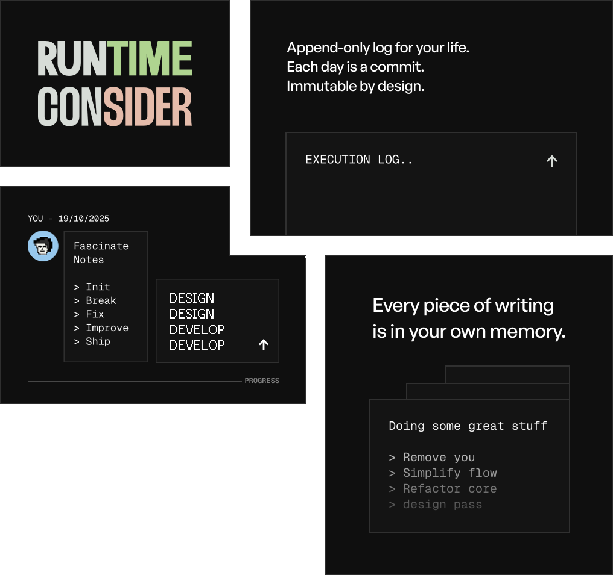

  

  <h1 align='center'>
    Runtime Consider
  </h1>

  

    Recording what actually happened
  

 

  

 

About Runtime Consider

 

Runtime Consider is a desktop-app to produce place that where you write down what happened each day

Runtime Consider is not a habit tracker of it like a log file. One entry per day and once you save it that's it no editing later

Open the Runtime Consider if you haven't written today you get a plain text box. Write it hit save and that it. 
 

### License

MIT License 
Copyright (c) Peakk2011 2026 
